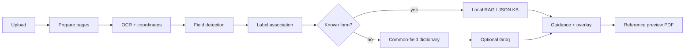

# FormSathi: AI-Powered Multilingual Form Assistant

FormSathi analyzes an uploaded form, detects fillable fields, explains each field in simple language, highlights where the answer belongs, provides English, Hindi, and Kannada text and voice guidance, collects answers locally, and generates a **Completed Reference Preview** for the user to copy onto the official form.

## Problem statement

Government, banking, insurance, educational, and financial forms often use unfamiliar terminology and dense layouts. First-time users may know their own information but not what a field asks, why it is required, which format it expects, or where the answer belongs. Existing tools often stop at OCR or generic chat and do not connect guidance to the exact region on the page.

## Project objective

Build a hybrid Computer Vision + RAG assistant that localizes fields, retrieves trusted guidance for known synthetic forms, explains unknown fields without inventing official rules, and keeps the user in control of every answer.

## Product boundary and disclaimer

FormSathi is an **academic demonstration**, not an official submission service.

It does not:

- submit a form to a government, bank, insurer, school, or third party
- claim legal, financial, or government approval
- invent required values or official field meanings
- sign a document or imitate a signature
- silently alter the official source upload
- send user-entered personal values to an external LLM

Users remain responsible for verifying official instructions. Avoid highly sensitive real forms unless you trust the deployment environment.

## Features

- PNG, JPG, JPEG, WEBP, and PDF upload with MIME validation
- Page rendering, preprocessing, Tesseract OCR with word coordinates
- Detection of boxes, underlines, checkboxes, radios, dates, and signature areas
- Label-to-field association and known-form fingerprint matching
- Local knowledge-base RAG plus lexical fallback
- Optional Groq interpretation for unknown fields only
- English, Hindi, and Kannada stored guidance and browser text-to-speech
- Non-destructive answer overlay and Completed Reference Preview PDF
- Delete and start-over cleanup

## Architecture



### Known-form flow

OCR and layout features → fingerprint match → local field chunks → trusted multilingual guidance.

### Unknown-form flow

OCR and nearby labels → common-field dictionary → optional Groq interpretation of printed context → honest unavailable state if neither applies.

## Technology stack

- Frontend: React, TypeScript, Vite, Tailwind CSS, Lucide, Vitest
- Backend: FastAPI, Pydantic v2, OpenCV, Pillow, PyMuPDF, Tesseract, SQLite, ChromaDB, Sentence Transformers
- LLM: Groq OpenAI-compatible API behind a provider interface (optional)

## Installation with Docker

```bash
docker compose up --build
```

- Frontend: http://localhost:5173
- Backend: http://localhost:8000
- Swagger: http://localhost:8000/docs

## Local installation

### Backend (Windows / macOS / Linux)

```bash
cd backend
python -m venv .venv
# Windows
.venv\Scripts\activate
# macOS / Linux
source .venv/bin/activate
pip install -r requirements.txt
uvicorn app.main:app --reload --host 0.0.0.0 --port 8000
```

### Tesseract

- Windows: install UB-Mannheim Tesseract and set `TESSERACT_CMD=C:\Program Files\Tesseract-OCR\tesseract.exe`
- macOS: `brew install tesseract tesseract-lang`
- Linux: `sudo apt-get install tesseract-ocr tesseract-ocr-eng tesseract-ocr-hin tesseract-ocr-kan`

### Frontend

```bash
cd frontend
npm install
npm run dev
```

### Knowledge and samples

```bash
python scripts/_write_knowledge.py
python scripts/generate_samples.py
python scripts/seed_knowledge_base.py
```

## Environment variables

Copy `.env.example` to `.env`. Never commit `.env`.

Place `GROQ_API_KEY` and `GROQ_MODEL` only in the local `.env` file. The app starts without them. External AI runs only when `EXTERNAL_AI_ENABLED=true` and the user consents in the UI.

## Sample demonstration

1. Generate samples.
2. Open http://localhost:5173 and use **Try a synthetic Demo Bank form**, or upload `samples/demo_bank_account_opening.png`.
3. Confirm the known-form match, inspect overlays, switch languages, enter fictional answers, and download the reference preview.

## API endpoints

See Swagger at `/docs`. Core routes live under `/api/documents`, `/api/health`, and `/api/config`.

## Coordinate and overlay design

Backend normalization:

`normalized_x = x / image_width` (same for y, width, height).

Frontend overlays use percentages inside a wrapper that matches the displayed processed page.

## RAG, LLM privacy, and preview

Field guidance is chunked per field and language. Retrieval returns source metadata. Groq receives only printed labels and nearby OCR text. User answers never leave the browser except to this backend for preview rendering. Signature regions render `[SIGN MANUALLY]`.

## Testing

```bash
cd backend
pytest -q
python -m compileall app
ruff check .

cd ../frontend
npm install
npm run lint
npm run build
npm run test -- --run

python scripts/evaluate_pipeline.py --samples samples --output evaluation_results.json
python scripts/smoke_test.py
docker compose config
```

## Research evaluation

See `docs/research_evaluation.md`. Objective CV metrics are computed from ground truth. Human-rated metrics use `samples/human_review_template.csv` and must not be fabricated.

## Security and privacy

CORS is limited to configured origins. Uploads use server-side UUIDs. Path traversal is rejected for previews. Logs omit full OCR text and personal answers.

## Current limitations

- Field detection is heuristic and weaker on heavy tables and handwriting.
- Perspective correction uses the processed page as the display surface.
- Browser voices for Hindi and Kannada depend on the operating system.
- Groq is unused unless configured and consented.
- Confidence scores are heuristics, not calibrated probabilities.

## Future work

Optional vision models, more known-form templates, evaluator studies, and improved table detection.

## Academic context

This repository is a 7th-semester Computer Science project. FormSathi is not an official form-filing service.
