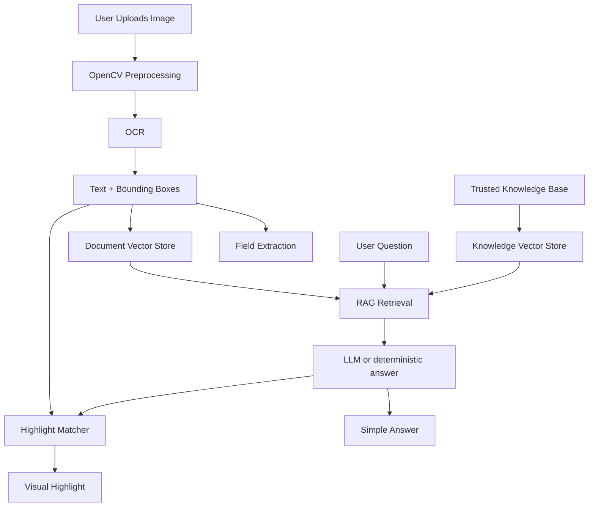

# AI-Powered Document & Medicine Label Reader

Upload a photographed document or medicine label, extract the printed text, ask grounded questions, and see the matching words highlighted on the image.

## Overview

This academic application helps people understand everyday paperwork:

- medicine labels
- electricity bills
- government notices
- insurance documents
- bank-related documents
- property-tax notices
- ration-card forms
- other photographed or scanned documents

It is designed for elderly users, non-technical users, people with limited English proficiency, and people facing literacy barriers.

## Problem Being Solved

Printed documents are often dense, small, or written in mixed languages. This project combines OpenCV preprocessing, Tesseract OCR, structured field extraction, retrieval-augmented generation, and visual highlighting so a user can:

1. Upload or photograph a document.
2. Read the extracted text.
3. See likely fields such as expiry date, amount, or account number.
4. Ask questions in English, Hindi, or Kannada.
5. See the relevant printed text highlighted on the image.

## Features

- Drag-and-drop image upload with validation
- OpenCV document detection, deskewing, and OCR enhancement
- Tesseract OCR with word-level bounding boxes and confidence
- Deterministic extraction of dates, amounts, medicine strength, batch numbers, and more
- Document-type detection with a user override
- Conversational Q&A with document-first grounding
- Trusted local knowledge base for supplemental explanations
- Visual highlight overlay using normalized OCR coordinates
- Easy Read Mode, language selection, original/enhanced image toggle
- Works without an LLM API key for OCR, extraction, highlighting, and common field questions
- Groq/OpenAI-compatible LLM with automatic API-key failover on rate limits

## System Architecture



## Technology Stack

- Frontend: React, TypeScript, Vite, Tailwind CSS
- Backend: Python 3.11, FastAPI, Pydantic, Uvicorn
- Computer vision: OpenCV, Pillow
- OCR: Tesseract via pytesseract
- RAG: ChromaDB and sentence-transformers (`all-MiniLM-L6-v2`), with a hashing-embedding fallback
- LLM: OpenAI-compatible client, configured for Groq by default

## How It Works

1. The image is stored under a server-generated UUID.
2. OpenCV attempts document-boundary detection and OCR enhancement. If detection is unreliable, the original image is used.
3. Tesseract returns full text, words, confidences, and pixel boxes. Boxes are normalized to 0–1 for the frontend overlay.
4. Regex and OCR structure extract fields such as `EXP: DEC 2027` or `Bill Amount: Rs 2450`.
5. OCR lines are chunked and indexed in ChromaDB. A local markdown knowledge base is indexed separately.
6. A question is classified by intent. Common field questions are answered deterministically. Other questions use retrieved document chunks, optional knowledge-base chunks, and the LLM.
7. Highlight matching prefers extracted-field boxes, then fuzzy OCR phrase matching.

## Project Structure

```text
.
├── README.md
├── .env.example
├── docker-compose.yml
├── backend/
│   ├── app/
│   ├── knowledge_base/
│   └── tests/
├── frontend/
│   └── src/
├── samples/
├── scripts/
└── data/
```

## Installation

Install Tesseract OCR on the host if you are not using Docker.

- Windows: install from the [Tesseract Windows installer](https://github.com/UB-Mannheim/tesseract/wiki) and ensure `tesseract` is on `PATH`, or set `TESSERACT_CMD`.
- macOS: `brew install tesseract tesseract-lang`
- Debian/Ubuntu: `sudo apt install tesseract-ocr tesseract-ocr-eng tesseract-ocr-hin tesseract-ocr-kan`

## Docker Setup

```bash
cp .env.example .env
docker compose up --build
```

The Groq keys can be placed in `.env` as `GROQ_API_KEY` and `GROQ_API_KEY_2`. If the first key is rate-limited, the backend switches to the second key automatically.

## Local Setup

### Backend

Windows PowerShell:

```powershell
cd backend
python -m venv .venv
.\.venv\Scripts\Activate.ps1
pip install -r requirements.txt
uvicorn app.main:app --reload --host 0.0.0.0 --port 8000
```

macOS / Linux:

```bash
cd backend
python -m venv .venv
source .venv/bin/activate
pip install -r requirements.txt
uvicorn app.main:app --reload --host 0.0.0.0 --port 8000
```

### Frontend

```bash
cd frontend
npm install
npm run dev
```

## Environment Variables

See `.env.example`.

| Variable | Purpose |
| --- | --- |
| `GROQ_API_KEY` | Primary Groq key |
| `GROQ_API_KEY_2` | Failover Groq key used on HTTP 429 / rate-limit errors |
| `OPENAI_API_KEY` | Optional extra OpenAI-compatible key |
| `OPENAI_MODEL` | Model name, default `llama-3.3-70b-versatile` |
| `OPENAI_BASE_URL` | Default `https://api.groq.com/openai/v1` |
| `FRONTEND_ORIGIN` | Allowed CORS origin |
| `MAX_UPLOAD_MB` | Upload size limit, default 10 |
| `TESSERACT_LANG` | Default `eng+hin+kan` |
| `TESSERACT_CMD` | Optional full path to the Tesseract binary |

Do not commit `.env`. API keys never go to the frontend.

## Running the Application

- Frontend: [http://localhost:5173](http://localhost:5173)
- Backend health: [http://localhost:8000/api/health](http://localhost:8000/api/health)
- Swagger UI: [http://localhost:8000/docs](http://localhost:8000/docs)

Generate demo images:

```bash
python scripts/generate_samples.py
```

## How to Use

1. Open the frontend.
2. Upload a PNG/JPG/WEBP image, or use a generated sample.
3. Wait for the processing stages to reach Ready.
4. Review detected fields and extracted text.
5. Ask a question, click a suggestion, or use **Explain Simply**.
6. Use **Where is...** questions to highlight printed values.
7. Use **New Document** to clear the session and delete stored files.

## Sample Demo Flow

1. Upload `samples/medicine_label.png`.
2. Confirm medicine name, `500 mg`, batch `ABC123`, and expiry `DEC 2027`.
3. Ask: `Where is the expiry date?`
4. Ask: `What dosage is written?`
5. Upload `samples/electricity_bill.png`.
6. Ask: `How much do I need to pay?` and `Where is the due date?`

## API Endpoints

- `GET /api/health`
- `GET /api/config`
- `POST /api/documents/upload`
- `GET /api/documents/{document_id}`
- `GET /api/documents/{document_id}/image/original`
- `GET /api/documents/{document_id}/image/processed`
- `GET /api/documents/{document_id}/ocr`
- `GET /api/documents/{document_id}/fields`
- `PATCH /api/documents/{document_id}/type`
- `POST /api/documents/{document_id}/ask`
- `DELETE /api/documents/{document_id}`

Interactive docs: `/docs`.

## Testing

Backend:

```bash
cd backend
pytest
```

Frontend:

```bash
cd frontend
npm install
npm run test -- --run
npm run build
```

Smoke test against a running backend:

```bash
python scripts/smoke_test.py --base-url http://127.0.0.1:8000
```

## RAG Architecture

Two collections are stored in ChromaDB:

- Uploaded document chunks built from OCR lines, with word IDs in metadata
- Trusted markdown files in `backend/knowledge_base/`

Document-specific facts must come from the uploaded OCR context. Knowledge-base text is labelled as additional general information.

## OCR + Visual Highlighting Architecture

Each OCR word keeps pixel `x, y, width, height` plus image dimensions. The API returns normalized boxes:

```text
x / image_width, y / image_height, width / image_width, height / image_height
```

The browser overlay uses percentage CSS positioning. Highlights are not burned into the image. If perspective correction succeeded, the enhanced image is the coordinate space for OCR and is shown by default.

## Medicine Safety Considerations

This is an educational document-understanding tool. It is not a prescribing system.

It may explain printed name, strength, dosage text, expiry, manufacturer, warnings, and storage. It must not prescribe, change a dose, diagnose, or tell a user to stop medication. Uncertain OCR is described as uncertain. Supplemental medicine notes are labelled **Additional general information**.

## Privacy

Uploaded documents are processed for this demonstration application. Avoid uploading highly sensitive personal information unless the deployment environment is trusted. Use **New Document** to delete the current upload from local storage.

## Limitations

- OCR quality depends on lighting, focus, and print size.
- Hindi and Kannada OCR require the matching Tesseract language packs.
- Generative explanations need a reachable Groq/OpenAI-compatible API.
- The knowledge base is small and educational, not a clinical database.
- Coordinate mapping is for the image that OCR actually ran on.

## Future Improvements

- PDF and multi-page support
- Text-to-speech and microphone input
- Stronger handwriting OCR
- Verified medicine databases with explicit licensing
- User accounts and encrypted retention controls

## Academic Context

This repository is a 7th-semester academic project demonstrating computer vision, OCR, information extraction, retrieval-augmented generation, grounded LLM answers, and accessible interface design in one runnable system.

## Quick Demo

```bash
cp .env.example .env
docker compose up --build
```

Open [http://localhost:5173](http://localhost:5173).

An LLM API key is optional for OCR and deterministic extraction. Configure Groq keys in `.env` to enable generative explanations, translation, and open-ended questions. If one free-tier key hits a rate limit, the backend fails over to the second key automatically.
